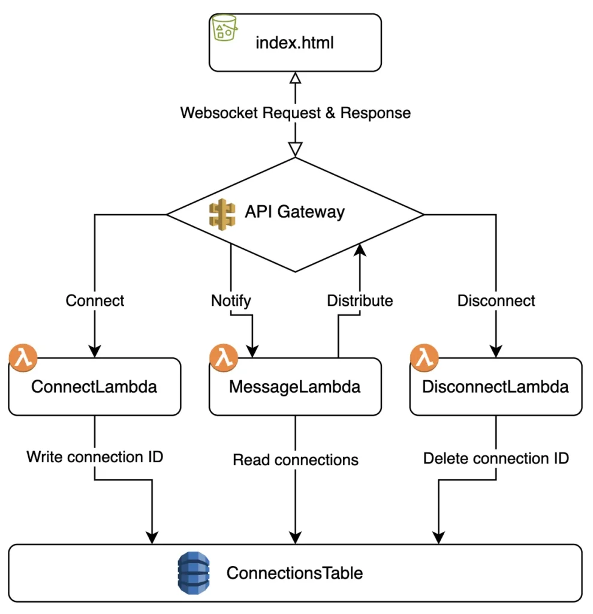

# Steps to set up the CDK code:

*from the root folder*

> mkdir challenge-3

> cd challenge-3
 
> cdk init app --language=typescript

# What are we going to build



# Lambda's

Let's first create the websocket setup:

1. Create a lambda to create new websocket connections
2. Create a lambda to drop connections
3. Create a lambda to receive and send messages

* In the root of the challenge-3 folder, create a folder called `website`
* In that folder add the `index.html`, `dartboard.js` and `dartboard.svg` files
* We do this because for the websockets we need to adjust the `index.html` and we leave the original as backup

Create three files in a folder called `lambda` in the root directory of `challenge-3`
* connect.js
* disconnect.js
* message.js

## connect.js

```ts
import { DynamoDBDocument } from '@aws-sdk/lib-dynamodb';
import { DynamoDB } from '@aws-sdk/client-dynamodb';

const dynamo = DynamoDBDocument.from(new DynamoDB());
export const handler = async (event) => {
	const addConnectionParameters = {
		TableName: process.env.TABLE_NAME,
		Item: {
			connectionId: event.requestContext.connectionId,
			timestamp: new Date().toISOString()
		}
	};

	try {
		await dynamo.put(addConnectionParameters);
		return {statusCode: 200, body: 'Connected.'};
	} catch (err) {
		console.error('Error during onConnect:', err);
		return {statusCode: 500, body: 'Failed.'};
	}
};
```

## disconnect.js

```ts
import { DynamoDB } from '@aws-sdk/client-dynamodb';
import { DynamoDBDocument } from '@aws-sdk/lib-dynamodb';

const dynamo = DynamoDBDocument.from(new DynamoDB());

export const handler = async (event) => {
	const deleteConnectionsParameters = {
		TableName: process.env.TABLE_NAME,
		Key: {
			connectionId: event.requestContext.connectionId
		}
	};

	try {
		await dynamo.delete(deleteConnectionsParameters);
		return {statusCode: 200, body: 'Disconnected.'};
	} catch (err) {
		console.error('Error during onDisconnect:', err);
		return {statusCode: 500, body: 'Failed.'};
	}
};
```

## message.js

```ts
import { DynamoDB } from '@aws-sdk/client-dynamodb';
import { DynamoDBDocument } from '@aws-sdk/lib-dynamodb';
import { ApiGatewayManagementApiClient, PostToConnectionCommand } from '@aws-sdk/client-apigatewaymanagementapi';

const dynamo = DynamoDBDocument.from(new DynamoDB());

export const handler = async ({body, requestContext}) => {
	const messageData = JSON.parse(body);

	const sendMessage = (connectionId) => {
		const apiGatewayClient = new ApiGatewayManagementApiClient({
			endpoint: `https://${requestContext.domainName}/${requestContext.stage}`
		});
		const postCommand = new PostToConnectionCommand({
			ConnectionId: connectionId,
			Data: Buffer.from(JSON.stringify(messageData))
		});
		return apiGatewayClient.send(postCommand);
	};

	const connectionTableName = {
		TableName: process.env.TABLE_NAME
	};
	const connections = await dynamo.scan(connectionTableName);

	const sendMessagesToAllConnections = connections.Items?.map((item) =>
		sendMessage(item.connectionId)
	);

	try {
		await Promise.all(sendMessagesToAllConnections);
		return {statusCode: 200, body: 'Message sent.'};
	} catch (err) {
		console.error('Error during sendMessage:', err);
		return {statusCode: 500, body: 'Failed.'};
	}
};
```

# CDK Deployment Code

Open lib/challenge-3-stack.ts

We need a table to store the connection id's of the players. Add the code in the constructor

```ts
import {AttributeType, BillingMode, Table} from 'aws-cdk-lib/aws-dynamodb';

const table = new Table(this, 'MessagesTable', {
	tableName: "DartPlayers",
	partitionKey: {
		name: 'connectionId',
		type: AttributeType.STRING
	},
	billingMode: BillingMode.PAY_PER_REQUEST
});
```

We also need to create the three lambda's in CDK (Note: import Function from Lambda, by default it's a JS concept too)

```ts
import {Code, Runtime, Function} from 'aws-cdk-lib/aws-lambda';

const onConnectLambda = new Function(this, 'OnConnectLambda', {
	functionName: 'ConnectLambda',
	runtime: Runtime.NODEJS_20_X,
	handler: 'connect.handler',
	code: Code.fromAsset(`lambda`),
	environment: {
		TABLE_NAME: table.tableName
	}
});

const onDisconnectLambda = new Function(this, 'OnDisconnectLambda', {
	functionName: 'DisconnectLambda',
	runtime: Runtime.NODEJS_20_X,
	handler: 'disconnect.handler',
	code: Code.fromAsset(`lambda`),
	environment: {
		TABLE_NAME: table.tableName
	}
});

const sendMessageLambda = new Function(this, 'SendMessageLambda', {
	functionName: 'MessageLambda',
	runtime: Runtime.NODEJS_20_X,
	handler: 'message.handler',
	code: Code.fromAsset(`lambda`),
	environment: {
		TABLE_NAME: table.tableName
	}
});

table.grantReadWriteData(onConnectLambda);
table.grantReadWriteData(onDisconnectLambda);
table.grantReadWriteData(sendMessageLambda);
```

Create an API Gateway to handle the websocket requests

```ts
import {CfnOutput} from 'aws-cdk-lib';
import {WebSocketApi, WebSocketStage} from 'aws-cdk-lib/aws-apigatewayv2';
import {WebSocketLambdaIntegration} from 'aws-cdk-lib/aws-apigatewayv2-integrations';

const webSocketApi = new WebSocketApi(this, 'WebSocketApi', {
	connectRouteOptions: { integration: new WebSocketLambdaIntegration( 'connect', onConnectLambda ) },
	disconnectRouteOptions: { integration: new WebSocketLambdaIntegration('disconnect', onDisconnectLambda) },
	defaultRouteOptions: { integration: new WebSocketLambdaIntegration('message', sendMessageLambda ) }
});

webSocketApi.grantManageConnections(sendMessageLambda);

const deploymentStage = new WebSocketStage(this, 'DevelopmentStage', {
	webSocketApi,
	stageName: 'dev',
	autoDeploy: true
});

new CfnOutput(this, 'WebSocketUrl', { value: deploymentStage.url });
```

# Website adjustments

We need to alter the `index.html` to send, receive and display the messages from all players.

You can replace both the `section-hit` eventlistener and the `submitEventToApi` methods with the following code:

```ts
document.querySelector('dart-board').addEventListener('section-hit', (event) => {
    sendDartScore({ event: event.detail, player: playersTurn });
});

const webSocketURL = 'wss://73t9o52x78.execute-api.eu-west-1.amazonaws.com/dev';
const chatBox = document.getElementById('chat-box');
let webSocket;

const connect = () => {
    webSocket = new WebSocket(webSocketURL);
    webSocket.onmessage = receiveDartScore
}

const receiveDartScore = ({ data }) => {
	const { player, event } = JSON.parse(data);
	if (player === 1) {
		player1Scores.push(event);
	} else {
		player2Scores.push(event);
	}
	dartThrown();
	render();
}

const sendDartScore = detail => webSocket.send(JSON.stringify(detail))
window.onload = connect;
```

> npm run build

---

Is this your first time? Then you need to prepare:

> aws configure sso

---

> aws sso login --profile {profile-here}

> cdk deploy

# Hooray!

Open the index.html file you adjusted, edit the websocket URL and you have multiplayer!

Now, the game isn't working yet, no real rules are implemented. If you want feel free to finish it.

To combine challenge 2 and 3, simply update the website folder in challenge 2 with the new 
`index.html` file from challenge 3 and re-deploy! Now you created a multiplayer cloud game!
